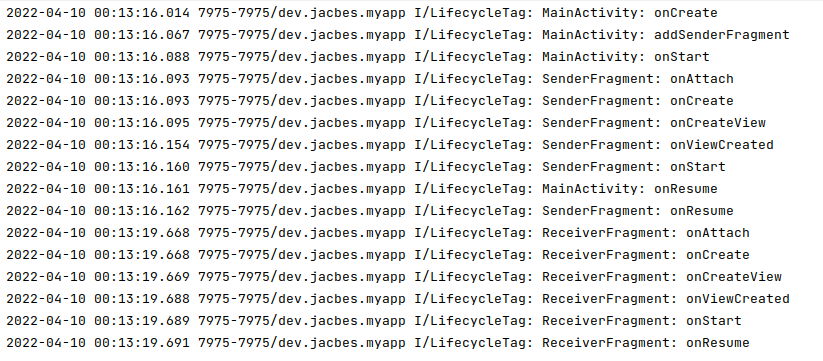
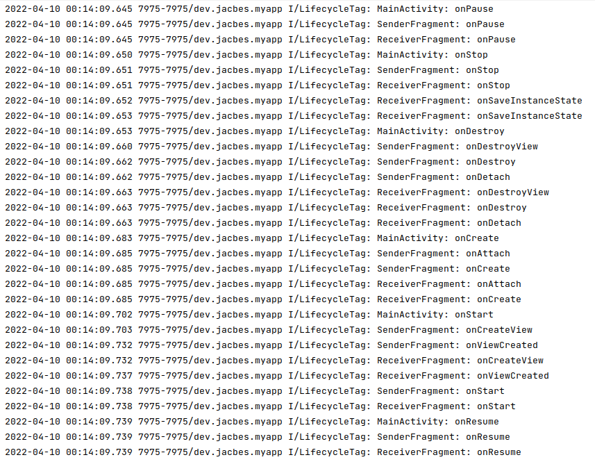
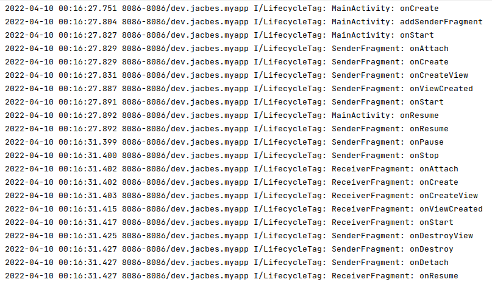
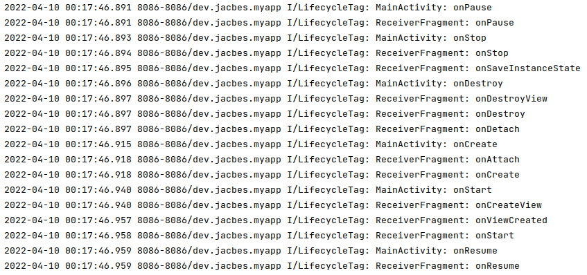
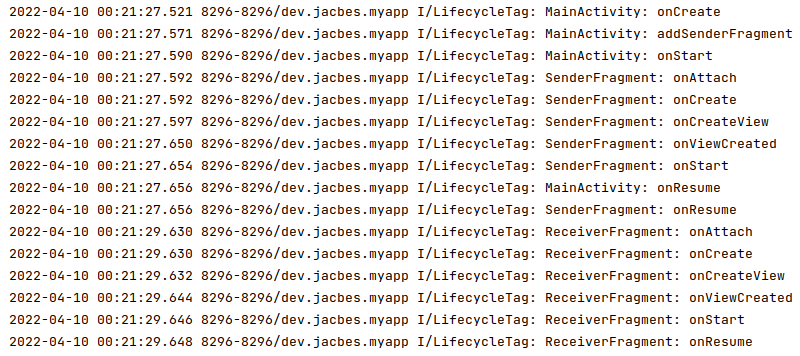
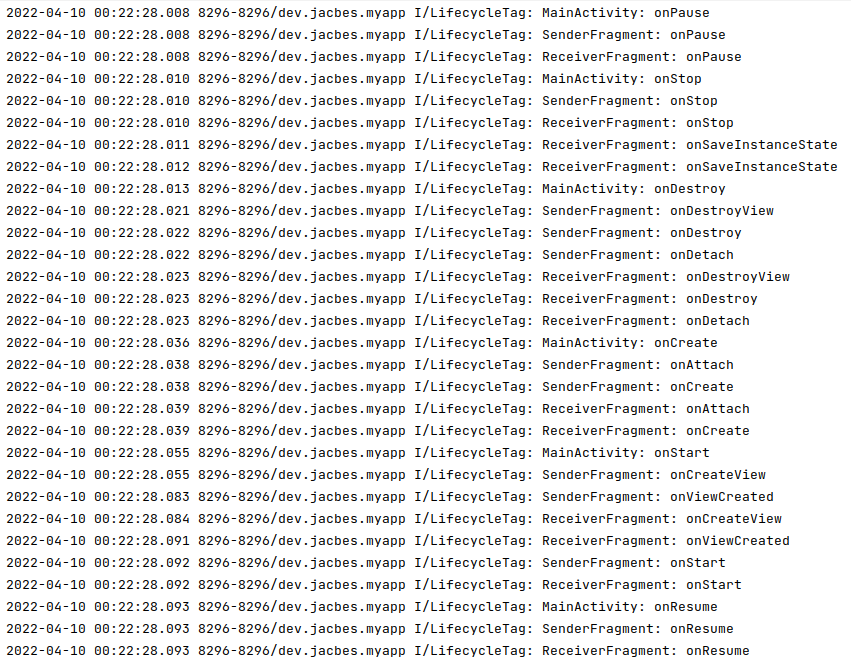
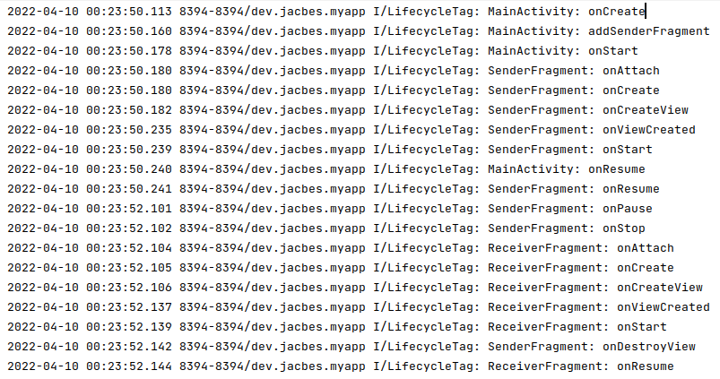
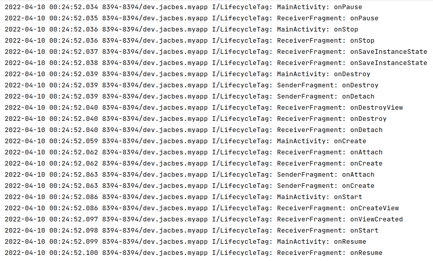

Сценарий:\
На экране FragmentA в состоянии Resumed, по клику на кнопку выполнить
транзакцию X для FragmentB. На FragmentB повернуть экран.

Вопросы:
1) В каком состоянии до поворота экрана будут находяться FragmentA и FragmentB?
2) В каком состоянии после поворота будут находиться FragmentA и FragmentB?
3) Какой колбэк будет обработан последним в каждом из фрагментов?

Транзакции X:
1) add
2) replace
3) add + addToBackStack
4) replace + addToBackStack

1) Add
   1) SenderFragment - Resumed\
      ReceiverFragment - Resumed\
      
   2) SenderFragment - Resumed\
      ReceiverFragment - Resumed
      
   3) SenderFragment: onResume\
      ReceiverFragment: onResume
2) Replace
   1) SenderFragment - Destroyed\
      ReceiverFragment - Resumed
      
   2) SenderFragment - Destroyed\
      ReceiverFragment - Resumed
      
   3) SenderFragment: onDetach\
      ReceiverFragment: onResume
3) Add+Backstack
   1) SenderFragment - Resumed\
      ReceiverFragment - Resumed
      
   2) SenderFragment - Resumed\
      ReceiverFragment - Resumed
      
   3) SenderFragment: onResume\
      ReceiverFragment: onResume
4) Replace+Backstack
   1) SenderFragment - Destroyed\
      ReceiverFragment - Resumed
      
   2) SenderFragment - Created\
      ReceiverFragment - Resumed
      
   3) SenderFragment: onCreate\
      ReceiverFragment: onResume